Нужно создать сайт для хакатона. 
Изначальное тз:
Промпт на создание сайта экскурсии по Нижнему Новгороду
Нужен современный одностраничный сайт экскурсионного маршрута по Нижнему Новгороду с интерактивной картой и аудиогидом.
Общая концепция
Атмосфера - историческая, тёплая, интеллигентная, с ощущением глубины времени.
Стиль - минимализм + музейная эстетика.
Настроение - «погружение в историю города».
Примерная цветовая палитра:
Белый (#fff5ee)
Кремовый (#f2ddc6)
Глубокий чёрный (#1A1A1A)
Акценты - тёмно-коричневый
Без ярких цветов. Всё мягко, благородно и тепло.
Структура сайта
1. Главная страница
   Фон: затемнённое историческое изображение Нижнего Новгорода (ярмарка, кремль, Волга, купеческая архитектура).
   Тёплый/темный фильтр поверх изображения.
   По центру:
   Заголовок:
   «Нижегородская Ярмарка. 3 мира за 2 часа»
   Подзаголовок:
   «Петербург-голова, Москва – сердце, а Нижний Новгород – карман России» - поговорка 19 века
   Кнопки:
   «Начать маршрут»
   «Открыть карту»
   При скролле — плавная анимация появления блоков.
2. О маршруте
   Краткое описание:
   Продолжительность – 2 часа
   Количество точек
   Формат (аудиогид)
   Для кого подходит
   Оформление – пункты в прямоугольных блоке (фон в блоке бежевый, текст черный/темно коричневый). Фон страницы темно коричневый
3. Интерактивная карта (ключевой блок)
   Большой экранный блок.
   Фон — стилизованная карта Нижнего Новгорода (в минималистичном стиле, без Google-палитры). В основном нижняя часть города крупным планом
   На карте размещены точки маршрута (в виде небольших стилизованных зданий экскурсии).
   При клике на объект:
   Открывается карточка справа или всплывающее окно
   Отображается:
   Название объекта
   Историческая справка (3–5 строк)
   Кнопка «Слушать»
   Аудиоплеер с возможностью паузы/перемотки
   Дополнительно:
   Анимация появления карточки
   Подсветка активного места на карте
   Возможность переключаться между объектами без перезагрузки страницы
4. Раздел «Все точки маршрута»
   Список объектов в виде минималистичных карточек:
   Название
   Краткое описание
   Время прослушивания
   Кнопка «Перейти на карте»
5. Подвал
   Минималистичный:
   Список партнеров
   Контакты
   Кнопка «Вернуться к началу»
   Дизайн-детали:
   Много воздуха
   Тонкие линии-разделители
   Мягкие тени
   Плавные анимации
   Никаких ярких кнопок
   Скругление углов — минимальное (4–6px)
   Шрифты (минимализм, историческая интеллигентность)
   Manrope — современный, чистый, хорошо смотрится в интерфейсах
   Inter — нейтральный и технологичный
   Cormorant Garamond (для заголовков) + Manrope (для текста) — если нужен лёгкий исторический оттенок
   Montserrat — строгий и лаконичный для основного текста (жирность средняя)
   Оптимальная комбинация:
   Заголовки — Cormorant Garamond (жирный)
   Основной текст — Manrope (жирность средняя)
   Дополнительные эффекты
   Лёгкий эффект зерна поверх фоновых изображений
   Тёплый градиент сверху главного блока
   Плавный scroll
   Небольшой параллакс на главном экране (по возможности)

## ПРАВКИ
Ты сейчас релизовал чать функционала. Сайт делается на конкурс для Нижнего Новгорода
Нужно внести правки и сделать сайт многостраничным.
**Главная страница:**
Изменения:
увеличиваем шрифт
заголовок в две строчки:
- Нижегородская ярмарка (первая строка, текст более жирный)
- 3 мира за 2 часа (вторая строка, текст нежирный, немного меньше чем 1-ая строка)
  слоган “Петербург – голова, Москва – сердце, а Нижний Новгород – карман России ” - поговорка XIX века
  (данный слоган мы расположим снизу, но по середине)
  меняем фон страницы на данное фото:
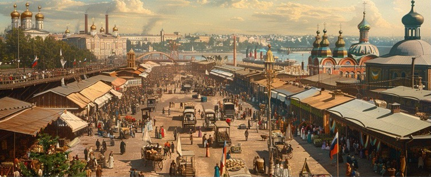

Макет (как схематично можно сделать):
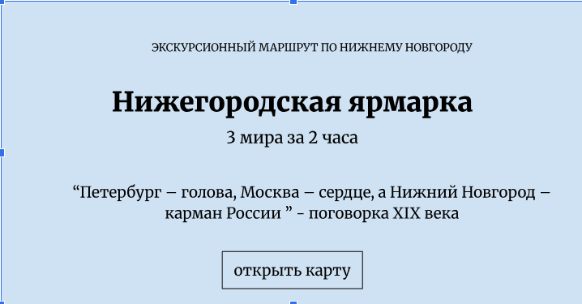

Кнопка:
кнопка - “открыть карту”, при ее нажатии пользователь переходит ниже по сайту к интерактивной карте

**Раздел О МАРШРУТЕ:**
ИЗМЕНЕНИЯ:
вставляем текст:
На этом маршруте мы разгадаем главный феномен города: как захудалая переправа превратилась в место встречи мировых цивилизаций. Вы увидите Царский павильон, куда приезжал Николай II, узнаете тайну подземных каналов Бетанкура и услышите истории самых богатых людей XIX века, которые ходили в простых кафтанах и кормили всю Россию.
формат:
Аудиогид на 4 языках

Макет (как схематично можно сделать):
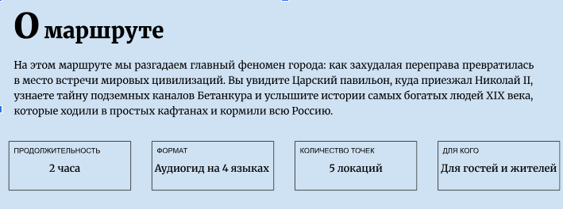

**ИНТЕРАКТИВНАЯ КАРТА МАРШРУТА:**
МАКЕТ:
увеличиваем шрифт;  используем для заголовков жирный шрифт
надписи над аудиодорожками (их будет 4, так как у нас 4-е языка)
Русския язык, English language,中国语文科, Françai

векторные рисунки на карте(точки маршрута) являются кнопками, соответственно, при нажатии на точку маршрута, меняется наполнение правого окна

например: при нажатии на первое фото (Канавинский мост) – в правом окне появляется инфа про него и аудио
кнопка  фото:
при ее нажатии открываются исторические фотографии канавинского моста, соответственно, там должна быть кнопка для возвращения к интерактивной карте
МАКЕТ:
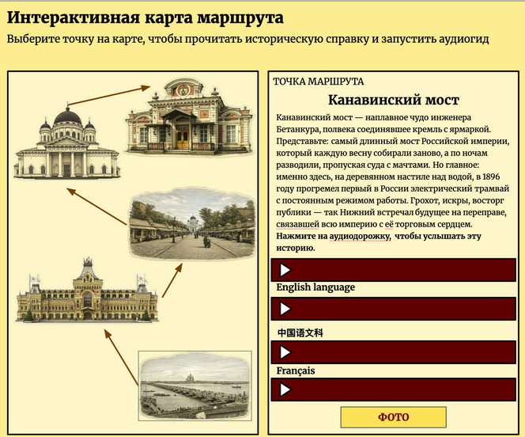

**ВСЕ ТОЧКИ МАРШРУТА**
макет:
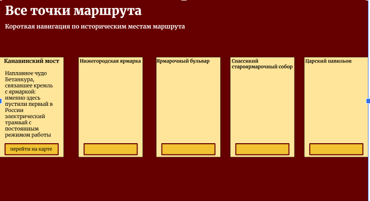
увеличиваем шрифт, делаем крупно и читаемо
внизу, каждой точке маршрута принадлежит свое окно;
в окне указано название точки, текст и кнопка (перейти на карте), при ее нажатии открывается интерактивная карта этой точки

**Партнеры и контакты**
МАКЕТ:
на данном макете мы ничего не меняем кроме заполняемости:

увеличиваем шрифт, что-то делаем жирнее, чтобы лучше выглядело визульно!
Партнеры:
·      Научно-исследовательский университет Высшая школа экономики
·      Нижегородский государственный художественный музей
·      Волго-Вятское главное управление Банка России
Контакты:
nnhistorictrip@gmail.com

КНОПКА:
“ВЕРНУТЬСЯ К НАЧАЛУ”, при ее нажатии возвращаемся на главную страницу сайта

**ФОТО:**
ГЛАВНАЯ СТРАНИЦА:
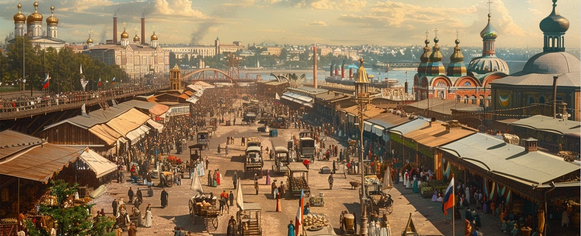
*данное фото мы устанавливаем на задний фон (возможно, придется немного затонировать, чтобы текст был читаемым)

ИНТЕРАКТИВНАЯ КАРТА:
1. точка 1 - Канавинский мост
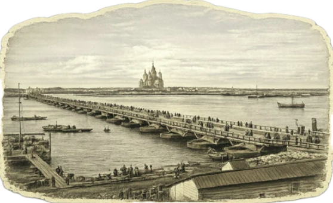
   текст для правого окна:
   Канавинский мост — наплавное чудо инженера Бетанкура, полвека соединявшее кремль с ярмаркой. Представьте: самый длинный мост Российской империи, который каждую весну собирали заново, а по ночам разводили, пропуская суда с мачтами. Но главное: именно здесь, на деревянном настиле над водой, в 1896 году прогремел первый в России электрический трамвай с постоянным режимом работы. Грохот, искры, восторг публики — так Нижний встречал будущее на переправе, связавшей всю империю с её торговым сердцем.
   Нажмите на аудиодорожку, чтобы услышать эту историю.

кнопка ФОТО:
при нажатии на нее открываются следующие фото
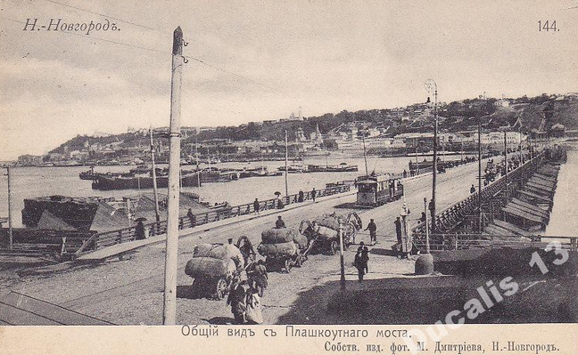
2. точка 2 - Нижегородская ярмарка
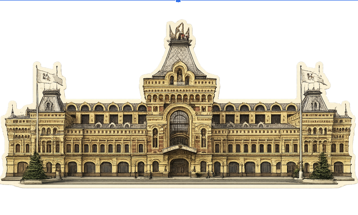
   текст для правого окна:
   Нижегородская ярмарка — главный торг Российской империи, куда после пожара 1817 года перенесли знаменитое Макарьевское торжище и где граф Румянцев пророчил Нижнему звание «третьей столицы». Представьте: на стрелке Оки и Волги, среди двухэтажных каменных корпусов, встречались купцы со всего света — от Персии и Китая до Европы и Америки. Товарооборот рос с 24 до 57 миллионов рублей, а население города на время ярмарки раздувалось в 13 раз: 15 тысяч торгующих и до 200 тысяч посетителей съезжались сюда, чтобы продать, купить и просто подивиться на это вавилонское столпотворение.
   Нажмите на аудиодорожку, чтобы оказаться в самом сердце этого торга.

кнопка ФОТО:
при нажатии на нее открываются следующие фото
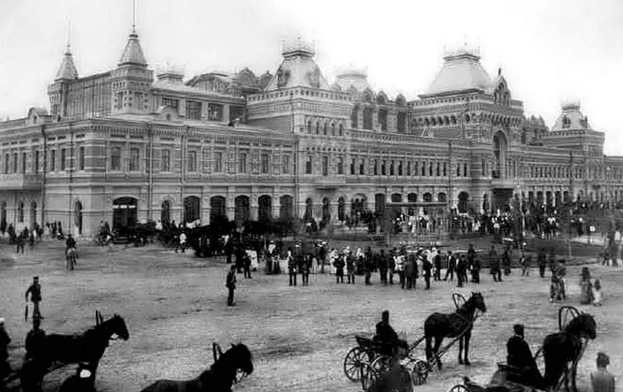
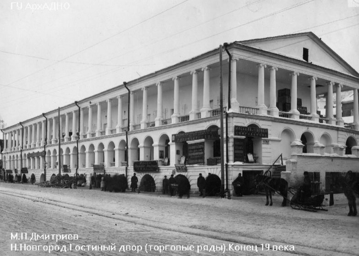

3. точка 3 – Ярмарочный бульвар
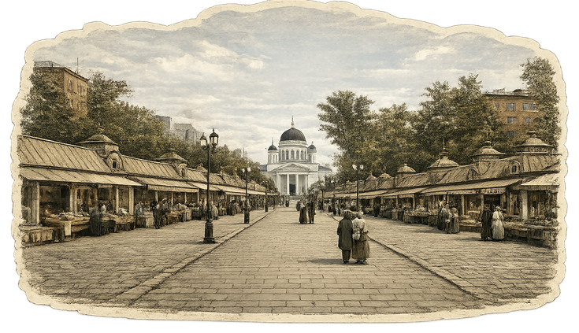
   текст для правого окна:
   Здесь Европа действительно встречалась с Азией: в Китайском проезде торговали чаем, который везли два года, в персидских рядах пахло шелком и сухофруктами, астраханскую рыбу грузили у пристани, уральское железо заполняло склады. Под ногами гуляла первая в России канализация, а фонтаны служили противопожарной защитой. Крики зазывал, звон колоколов, запах чая и ковров — всё это кипело полтора месяца, чтобы Нижний навсегда остался «карманом России».
   Слушайте аудиодорожку и погружайтесь в атмосферу главного торга империи.

кнопка ФОТО:
при нажатии на нее открываются следующие фото
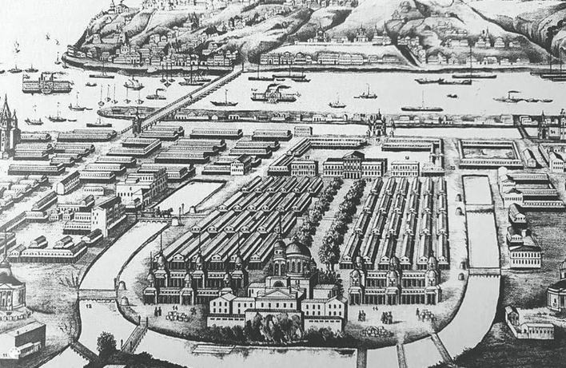
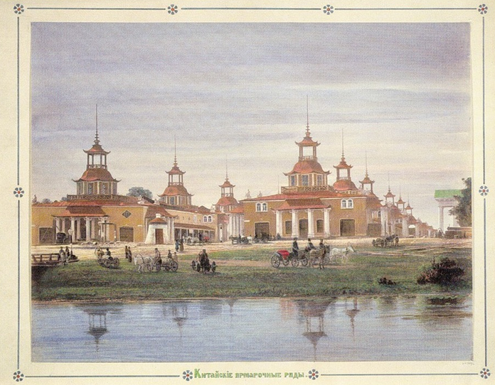
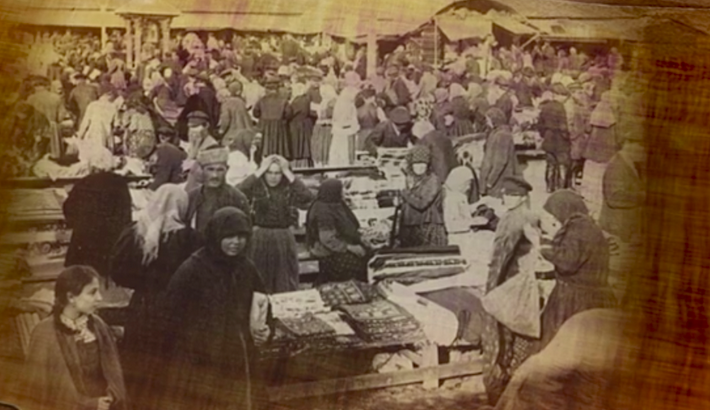
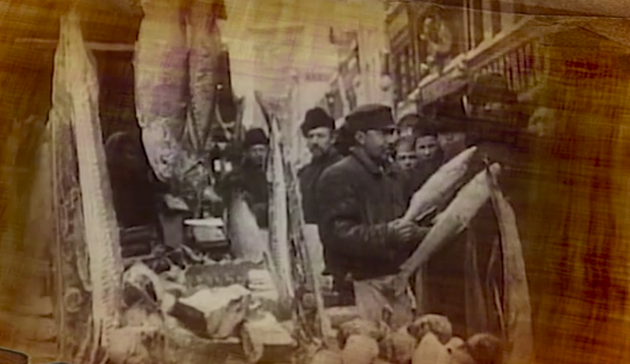
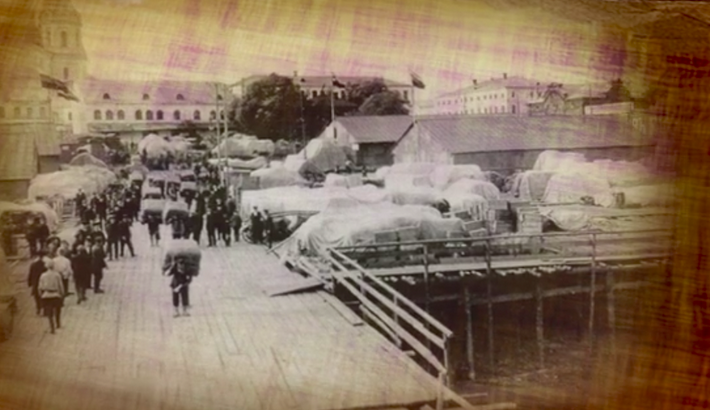
4. точка 4 – Спасский староярмарочный собор
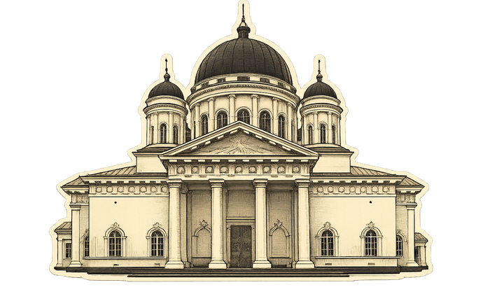
   текст для правого окна:
   Единственный в России храм, построенный по чертежам Исаакиевского собора, — и с самой неожиданной проблемой: каждую весну Ока разливалась так, что к дверям причаливали лодки, а купеческие товары мокли в подвалах прямо во время службы. Но главный скандал случился из-за икон: итальянец Торричелли изобразил святых такими «живыми» и мускулистыми, что сибирские купцы отказывались им молиться и приносили в собор свои домашние образки.
   Нажмите на аудиодорожку, чтобы узнать, чем закончилась эта история.

кнопка ФОТО:
при нажатии на нее открываются следующие фото
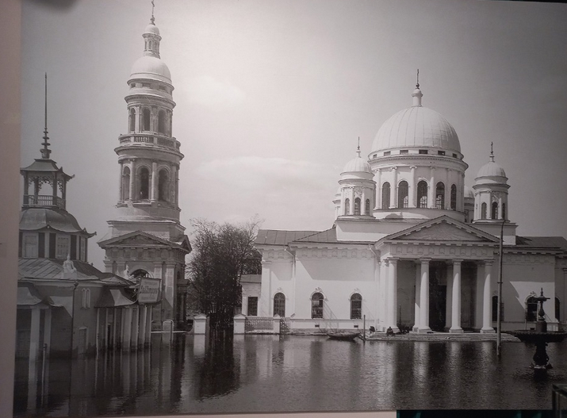
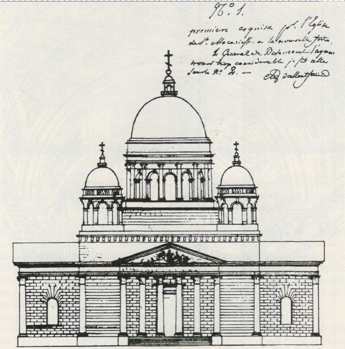

5. точка 5 – Царский павильон
   текст для правого окна:
   Императорский павильон — единственный уцелевший свидетель царского величия на нижегородском вокзале: изящный дворец с башенками и гербами, построенный специально к приезду Николая II. Планировали скромное здание за 15 тысяч, но потратили почти 60 — зато с мраморным камином и отдельными туалетами для каждого высокого гостя, что по тем временам было неслыханной роскошью. После революции павильон чудом уцелел, когда главное здание вокзала превратили в советскую «коробку».
   Нажмите на аудиодорожку, чтобы узнать, как император принимал гостей в этом маленьком дворце.

кнопка ФОТО:
при нажатии на нее открываются следующие фото
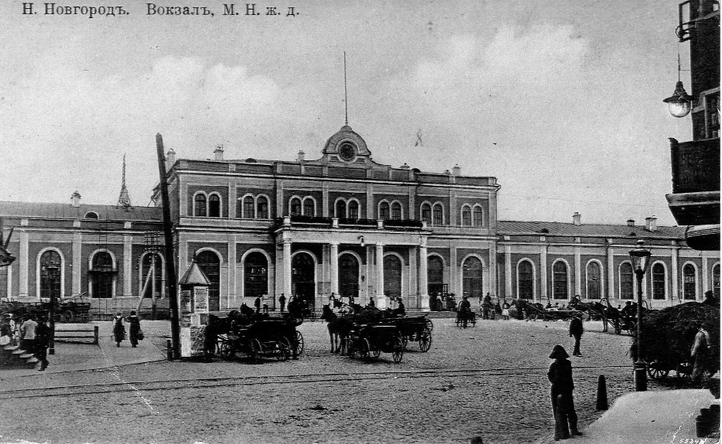
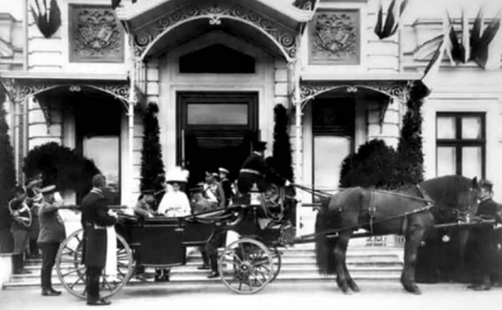
